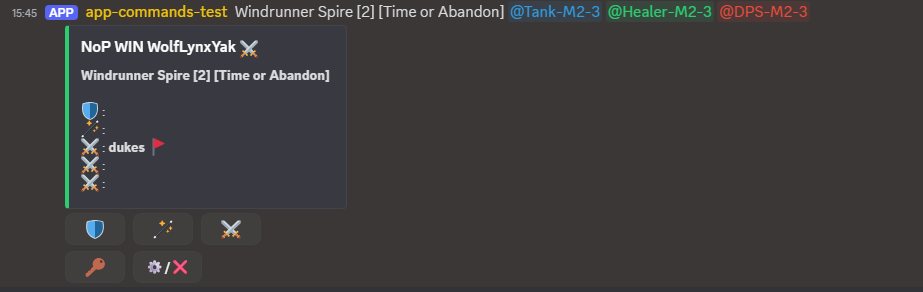
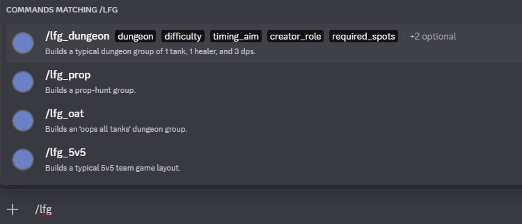

# Discord-LFG

This is a Python based system for Discord to allow easy creation of groups, using the library [`discord-py`](https://discordpy.readthedocs.io/en/stable/).



It was originally based on the Dungeon Buddy system written by Baddadan for No Pressure EU, and
is still significantly inspired by that system although has been generalised significantly.

## Use of AI

I dislike having to put this here but this is the way of the world now.

I used Copilot to help me understand some of the Discord API elements, particularly where
particular interactions between elements were not obvious when debugging (e.g. the order
of how views are updated / presented). I also used Copilot to help generate templates of some of
the option menus, although most of this has now been overwritten or discarded.

## Background

<!--- --8<-- [start:docs] -->

Discord-LFG is a Discord bot originally created for easy creation of groups for
World of Warcraft dungeons.
These groups typically have one tank, one healer, and three damage dealers in each group.

Discord-LFG provides a structure for forming groups, using
slash commands, embeds, and buttons, making it easier to create and join groups, and
easier for moderators and users to track Discord usernames when groups are formed,
providing passwords only to those who sign up enabling a link
between the Discord signup and the in-game signup.

The commands and group listings are able to be configured by the bot host.
Some templates for different group types are included in the docs.

The [original Dungeon Buddy](https://bit.ly/3ZrVj7C) was built by Baddadan/Kashual using `DiscordJS` for
the [No Pressure EU](https://no-pressure.eu) Discord server.
This system is inspired by Dungeon Buddy, and implementated in
Python using [discord-py](https://discordpy.readthedocs.io/en/latest/api.html).

<!--- --8<-- [end:docs] -->

## Installation and setup

### Installation

<!--- --8<-- [start:docs-install-general] -->

To install Discord-LFG (`discord_lfg`), we recommend using [uv](https://docs.astral.sh/uv/).

``` shell
git clone git@github.com:aptosaurinae/discord-lfg.git
cd discord-lfg
uv sync
uv pip install -e .
```

To build the documentation locally you can run:

``` shell
uv run mkdocs serve
```

<!--- --8<-- [end:docs-install-general] -->

### Running

<!--- --8<-- [start:docs-running] -->

To run the bot you can then do the following:

``` shell
uv run python src/discord_lfg/bot.py path/to/token.toml path/to/config.toml
```

which should result in something like the following:

``` shell
PS C:\projects\discord-lfg> uv run python -m discord_lfg.bot "C:\projects\discord-lfg-data\token.toml" "C:\projects\discord-lfg-data\config.toml"
[2026-02-17 19:33:34] [INFO    ] discord.client: logging in using static token
[2026-02-17 19:33:35] [INFO    ] discord.gateway: Shard ID None has connected to Gateway (Session ID: 123456789).
Logged in as app-commands-test#2842 (ID: 123456789)
------
Discord-LFG started
logging to: C:\projects\discord-lfg-data\logging
stats outputting to: C:\projects\discord-lfg-data\stats
```

You should find that the bot slash commands are then active in the relevant server when it's given
a valid set of configuration files.

<!--- --8<-- [end:docs-running] -->

### File setup

In order to run the bot you'll need to give it a discord bot authentication token,
as well as a configuration of where the bot is going to load into and what commands it will
load.

See the documentation for full details of the configuration setup.

## Bot Commands

Once the bot is up and running, the commands that are active should match those defined in
the command files referenced by the main config.



### History and Stats

Two commands will always be present regardless of configuration:

- `/lfghistory` provides access to a users history. If you set up a moderator role in the
configuration, then anyone with that role will be able to use a discord user ID to look up that
users history.
- `/lfgstats` provides access to generic stats about how many groups have been formed using the
different commands within a particular timeframe,
with a breakdown by activity type. Querying can also be done by group
completion type: completed (filled), timed out, or cancelled.

## License

This project uses the same license as the original Dungeon Buddy, as below.

This project is licensed under the [CC BY-NC 4.0 License](https://creativecommons.org/licenses/by-nc/4.0/).

### Conditions

-   You **must credit** the original author in any fork, modification, or usage of this project by
adding the following to your Discord bot description:
    > Original code by Baddadan/Kashual for NoP EU. GitHub: https://bit.ly/3ZrVj7C \
    > Discord-LFG by dukes for NoP EU. https://github.com/aptosaurinae/discord-lfg
-   This code **cannot** be used in any product that is sold for money or restricted by a paywall.
This includes Discord member sections

If you have questions about the licensing terms, please contact Baddadan/Kashual at the
[No Pressure](https://discord.gg/nopressureeu) discord server.

### Modifications

As noted in the licence terms, modifications should be noted.
Primarily for this project this is that the discord bot has been rebuilt in Python,
which alters the structure of how many aspects are set up in and of itself.
It would be difficult to provide a full listing of all changes as a result.
The following list of changes has been made to functionality:

- The backend has been generalised significantly to make it possible to create custom commands,
although still within a "looking-for-group"/"group-building" framework.
- Significantly more configuration is available directly from the config, including the definition
of different commands that use the group builder with a variety of roles or user input options.
  - commands
  - roles
  - guild name
  - debug flag
  - timeout durations for the groups
- The embed has a colour stripe that matches the state of the group:
  - Green for open
  - Yellow for full but editable
  - Blue for full and not editable ("complete")
  - Red for cancelled or timed out
- When users are removed from the group, they are notified why and blocked from rejoining.
- The `lfghistory` command now provides access to a filterable set of data instead of just
the last 10 groups. `lfguserhistory` has been brought into the `lfghistory` command.
- The `lfgstats` command has been adjusted to be filterable by command.
