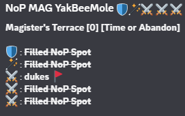

# Primary config

There are a set of required arguments for the general configuration, and then some additional
optional settings.

## Config Elements

### Required Elements

#### Guild ID

The discord ID of the server that you want the bot to be hosted in. This directly controls
where the commands are registered, separate from where the bot is invited to within Discord.

- Format: `int`
- Example: `guild_id = 123456789`

#### Command Files

A list of file path strings for where the [command config](command-config.md) files you want to use are.

- Format: `list[str]`
- Example: `command_files = ["path/to/command_config.toml"]`

#### Roles

You must define a set of global roles that commands can use.
Roles need a set of the following elements:

- emoji: The identifying emoji for the role, used in descriptions.
- indicator: the single character used for input when constructing a group.

A name will be constructed automatically from the name used to define the role.

- Format:
    - emoji: `str`
    - indicator: `str`
- Example:
```toml
[role.tank]
emoji = "🛡️"
indicator = "t"
```

The role name will be capitalised when converted into an autocomplete list as part of the command.

### Optional elements

#### Guild name

Both the group name that is automatically generated and the filled spot name used when creators
indicate that they have other players already in their group can be customised with a guild name.
If not given then the group name and filled spots will be missing these elements.

- Format: `str`
- Example: `guild_name = "NoP"`

This will result in the group name having `NoP` put in front of it, and any
`Filled Spot` being replaced with `Filled NoP Spot`, as shown in the image below.



#### Moderator role name

The name of a role that you want to give elevated permissions for the `lfghistory` command.
This allows those users with the role to input a user ID to lookup other users history.

- Format: `str`
- Example: `moderator_role_name = "Mods"`

#### Log folder

Defines the folder to dump log files into. Log files will be automatically named based on the
time the bot is started, and this folder must exist already or the bot will error.
If not given then no log files will be created.

- Format: `str`
- Example: `log_folder = "path/to/log_folder"`

#### Stats folder

Defines the folder to dump stats files into. Stats files will be automatically named based on the
completion time of the group, and this folder must exist already or the bot will error.
If not given then no stats files will be created.

- Format: `str`
- Example: `stats_folder = "path/to/stats_folder"`

#### Debug

Flag to define whether the bot should be started in debug mode.
If not given this will default to `false`.

- Format: `bool`
- Example: `debug = true`


## Example

An example config containing all required and optional elements is provided below.

```toml
guild_id = 123456789
guild_name = "NoP"
moderator_role_name = "Mods"
command_files = [
    "C:/discord-lfg-config/command_lfg_dungeon.toml",
    "C:/discord-lfg-config/command_lfg_dungeon_oat.toml",
]
log_folder = "C:/discord-lfg-config/logging"
debug = true

[role.tank]
emoji = "🛡️"
identifier = "t"

[role.healer]
emoji = "🪄"
identifier = "h"

[role.dps]
emoji = "⚔️"
identifier = "d"
```
