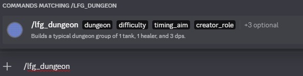
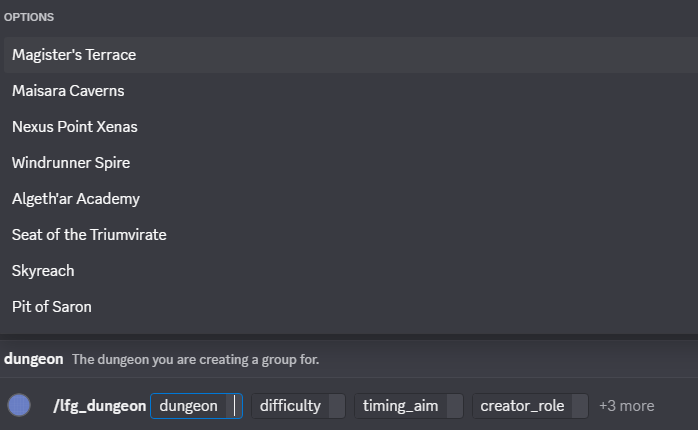
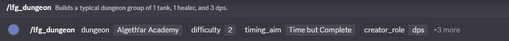

# Creating Groups

## Slash Commands

If you type `/` in a Discord server it will list all of the slash commands in the server.

This discord bot loads the following:

- `/lfgstats`: For reviewing summary statistics about all groups made in this server.
- `/lfghistory`: For looking up your personal history, or for moderators to look up other users
histories.
- Any other commands defined in the configuration for the bot on the server.

The `lfgstats` and `lfghistory` commands are covered in the [stats section of the user docs](stats.md).

## Forming a group

For this example we'll cover a World of Warcraft dungeon group, loaded as `/lfg_dungeon`. A group has 1 tank, 1 healer, and 3 dps.

On typing `/lfg_dungeon` you should be presented with a view showing the command. You can either click on this command or press enter or space to start filling in details for the command.

### Required elements

Once the command is loaded, you should see boxes appear for each of the required elements, in this case:

- Dungeon name
- Difficulty of the dungeon
- Timing aim
- Your role

When the text cursor is in each box, an autocomplete list will show up for that element.

You can either select these using any of the following:

- clicking on the entry in the list
- using the `up` and `down` arrows on the keyboard and press `enter` or `tab`
- typing the first part of the name to filter the list down, then pressing `enter` or `tab`

### Optional elements

Once you've filled in all of the required elements, you'll see that there are some additional optional elements that can be filled in. These are always the same for every command:

#### `filled_spots`
If you already have other group members, you can put in the role identifier for each person here and the group will post with these spots already filled in. If you don't provide a `filled_spots` entry then the group will post with all role spots available other than yours.

As an example, lets say I'm tanking a group and have a DPS and healer in my group already from my guild, who are also members of the Discord. I can put `hd` into the filled spots listing to indicate that I have a healer (`h`) and dps (`d`) with me. If I had three dps and no healer, I could put in `ddd` to indicate that I have three damage dealers.

If you make a mistake here and try to put in too many of a role, then the group creation won't happen and you can try again.

#### `listed_as`

Override the group name. If you don't provide a `listed_as` then a group name will be automatically generated for you.

#### `creator_notes`

Any notes you want to appear as part of the group listing. e.g. its your first time playing a particular role and you're not as confident, then you can use this to add a note about it.

### Posting the group and actions once it's posted

Once you've filled in all of the required elements and any optional elements you want to provide, press enter and the group will be posted.

You can see here that the group has posted and is available for users to join. The bot has sent an additional message just to the user saying what the passphrase is for the group. It's expected that you'd use this to verify that when someone signs up in game, they are one of those who signed up in the Discord group. If you dismiss this message then you can get a new message (with the same passphrase) by clicking on the `🔑` button.

If someone you know shows up after you've posted the group and you want to fill a spot for them, you can click on one of the role buttons and the bot will fill in one of those role slots with a filled spot.

If you want to remove filled spots or user signups, or you want to cancel the group, you can click on the `⚙️/❌` button to get a menu where you can then do this.
