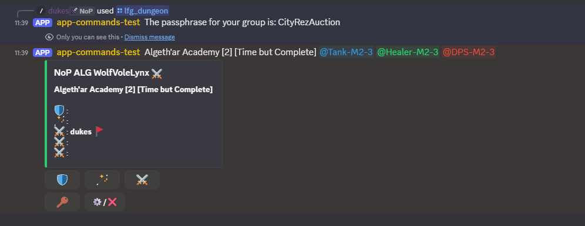

# Joining groups

Once a group has been set up in Discord it will look something like this:

## Joining a group

If you want to join the group, just click on one of the available role buttons under the listing. The role buttons have a label that matches the role icons in the listing.
The listing should then update to show your discord display name alongside one of the role icons for the role you've selected.

## Leaving a group

If you are not the group creator, you can leave the group by clicking on the `⚙️/❌` button.

## Passphrase reminder

While a member of the group you can click on the `🔑` button to get a reminder of the passphrase. If you are not a member of the group when you click this you should get a message saying you need to be a member of the group to see the passphrase.
