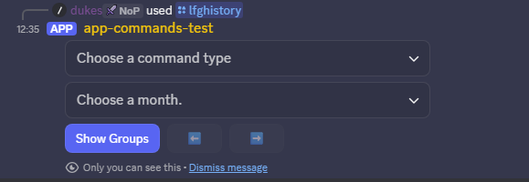
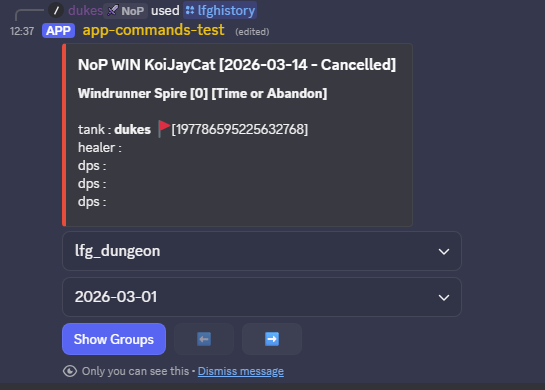
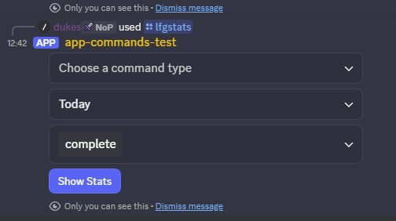
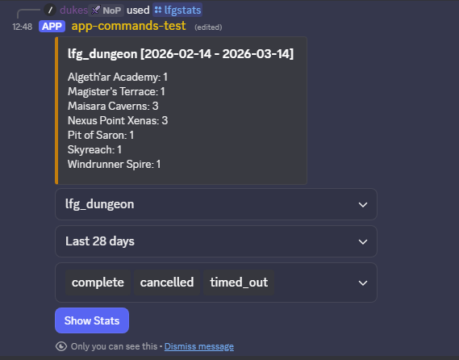

# History and Stats commands

## LFGHistory

The `/lfghistory` command provides a way to review your past groups. There is an optional field for another users Discord ID to see their history, but this is only available to users with a moderator role (as [defined in the config](../config/general-config.md) for the bot).

On using `/lfghistory` you should be presented with a message only you can see with some options:

You can either press `Show Groups` to show all historical groups you've been a part of, or use the drop down filters to filter the history by command or month, or both.

Once you've loaded a view, you can use the `⬅️` and `➡️` buttons to scroll through the groups.

The history viewer will stay active for a couple of minutes by default, depending on the bot configuration.

## LFGStats

The `/lfgstats` command provides a way to review statistics for the Discord server.

On using `/lfgstats` you should be presented with a message only you can see with some options:

You can then filter the stats using the drop down menus to find out aggregate stats about how many groups have been formed based on different commands, time periods, and whether groups were completed / cancelled / timed out.

